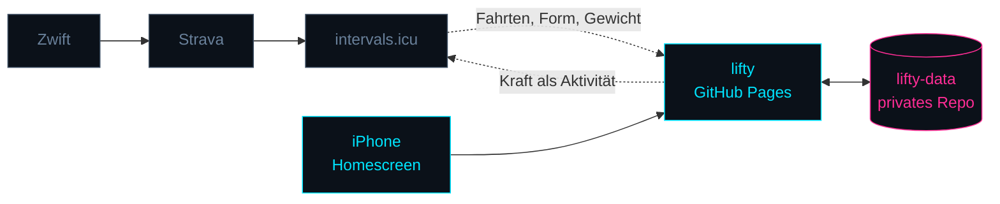
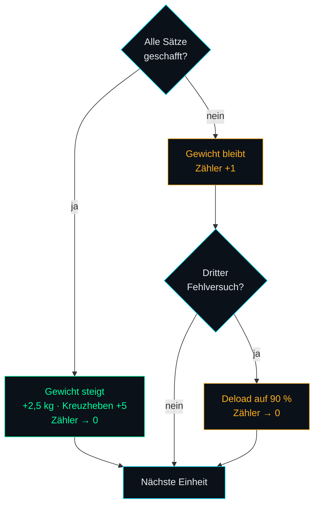

<p align="center">
  
</p>

<p align="center">
  <a href="https://cyphomat.github.io/lifty/"></a>
  
  
  
</p>

<p align="center">
  <b>Wochenplaner und Studio-Logger für StrongLifts 5×5, Radtraining und alles dazwischen.</b><br>
  Statische Web-App. Kein Build, keine Bibliotheken, kein Server, keine Datenbank.
</p>

---

## Wie es zusammenhängt



lifty besitzt die **Kraft**-Progression. Die StrongLifts-App wurde abgelöst — zwei
Systeme, die dasselbe Arbeitsgewicht berechnen, laufen unweigerlich auseinander.

Das **Rad** plant lifty nur als Hinweis. Die Ist-Daten entstehen ohnehin automatisch,
also werden sie gelesen statt nachgebaut.

Umgekehrt kann lifty jede Krafteinheit als Aktivität nach intervals.icu schreiben.
Damit liegt die gesamte Trainingslast in **einer** Fitness-Kurve statt in zwei
getrennten Welten. Der Schalter sitzt unter „Verbindungen"; die Übertragung ist aktiv, solange
sie nicht ausdrücklich abgeschaltet wird.

Die Trainingslast wird aus der Dauer geschätzt und in der Beschreibung offen als
Schätzung ausgewiesen. Ist keine Dauer bekannt, wird **nichts** übertragen: eine
erfundene Last wäre schlimmer als ein fehlender Eintrag.

---

## Das Programm

|  | Übung 1 | Übung 2 | Übung 3 |
|---|---|---|---|
| **Workout A** | Kniebeuge 5×5 | Bankdrücken 5×5 | Rudern 5×5 |
| **Workout B** | Kniebeuge 5×5 | Schulterdrücken 5×5 | Kreuzheben 1×5 |



Die Kniebeuge kommt in beiden Workouts vor und steigt daher doppelt so schnell.

5×5 ist auf drei Einheiten pro Woche ausgelegt. Bei ein bis zwei pro Woche gilt
dieselbe Mechanik, nur langsamer — A und B wechseln sich über zwei Wochen ab.

---

## Was die App im Studio macht

| | |
|---|---|
| **Sagt an, was der Tag will** | `TECHNIK`, `SOLIDE`, `HART` oder `SCHWER` — abgeleitet aus Pause, Fehlversuchen, Serie und Abstand zu den alten Arbeitsgewichten. Kein Zufallsgenerator. |
| **Wissen an der Stange** | Kadenz direkt sichtbar, aufklappbar Begründung, Cue, typischer Fehler und die Brücke zum olympischen Heben. |
| **Warm-up voreingestellt offen** | Nach langer Pause entscheidet das darüber, ob man in acht Wochen noch dabei ist. |
| **Technik und Finisher** | Snatch Balance, Hang Power Clean, Overhead Squat · Battle Ropes, Farmer Walk. Täglich rotierend. |
| **Zufalls-WOD** | AMRAP, Auf Zeit, EMOM, Chipper, Tabata. Lasten aus dem aktuellen Stand abgeleitet, nie zwei Langhantelteile. |
| **Verlauf** | Tonnage, Bestwerte, Verläufe je Übung als Kurve. Funktioniert auch ohne Netz. |
| **Pausenuhr** | 90 s, nach einem Fehlversuch 180 s, im Lauf um ±30 s verstellbar. |
| **Plattenrechner** | Scheiben pro Seite unter jeder Übung und für jeden Aufwärmsatz. Nicht exakt ladbare Gewichte werden als solche benannt, statt sie stillschweigend zu runden. |
| **Aufwärmsätze** | Aus dem Arbeitsgewicht gerechnet: leere Stange, dann 55 / 70 / 85 % mit absteigenden Wiederholungen. |
| **Gewicht im Satz** | Lässt sich während der Einheit anpassen. Das Log bildet ab, was passiert ist — die Progression rechnet von dort weiter. |
| **Bestwerte** | Schwerster sauberer Satz, gemessenes Einzel, geschätztes Maximum. Abgeleitet, nicht gepflegt. |
| **Max-Out** | Krafttest mit e1RM (Brzycki bis 6 Wdh., darüber Epley). Dreht den A/B-Wechsel nicht. |
| **Form** | Aus intervals.icu: Fitness minus Ermüdung. Ein Hinweis in der Tagesansage — die App kürzt keine Gewichte eigenmächtig. |
| **Radfahrten** | Im Verlauf: Fahrten, Stunden, Kilometer und die Wochenlast der letzten zwölf Wochen als Balken. |
| **Wiederholungen** | Tippen zählt das Ziel. Lange drücken öffnet 0 bis 12 — auch über dem Ziel, denn ein starker Satz ist eine Information. |

---

## Die tragende Invariante

> `state.json` ist **abgeleitet**, nicht gepflegt — eine Projektion aus
> `config.json` und allen Dateien in `einheiten/`.

„Neu berechnen" stellt sie jederzeit wieder her. Das ist der Grund, warum ein
vertippter Eintrag nie zum Problem wird: Datei korrigieren, neu berechnen, fertig.

Wer hier eine Abkürzung einbaut und `state.json` direkt fortschreibt, verliert
genau diese Eigenschaft. Dafür gibt es Tests.

---

## Die Rangordnung im Training

```
Rückgrat    5×5              messbar progressiv, trägt alles andere
Auffrischung Olympische Technik   leicht, im Warm-up-Slot, Qualität statt Last
Zugabe      Seile · Kondition     als Finisher ans Ende, nie davor
```

Das ist kein Geschmack, sondern der Grund, warum die Progression im
Kaloriendefizit überhaupt funktioniert. Wer den Finisher nach vorn zieht oder
die Technikarbeit schwer macht, kippt sie.

---

## Aufbau

| Datei | Rolle |
|---|---|
| `js/program.js` | Der 5×5-Automat. Reine Funktionen, kein I/O — deshalb testbar. |
| `js/coach.js` | Leitet Ansage, Ton und Fortschritt aus dem Zustand ab. Ebenfalls rein. |
| `js/wod.js` | Zufalls-WOD. Deterministisch über einen Seed. |
| `js/stats.js` | Tonnage, Bestwerte, Sparkline-Koordinaten. Rechnet, zeichnet nicht. |
| `js/content.js` | Wissensschicht: Warum je Übung, Cues, Warm-up, Technik, Finisher. |
| `js/store.js` | GitHub-API als Speicher, Offline-Puffer, Wiederholversuche. |
| `js/intervals.js` | Liest Fahrten, Form und Gewicht. Schreibt Krafteinheiten zurück, wenn eingeschaltet. |
| `js/app.js` | Oberfläche und Ablauf. |
| `sw.js` | Cacht die App-Hülle. Trainingsdaten bewusst **nicht**. |

---

## Tests

```sh
JSC=/System/Library/Frameworks/JavaScriptCore.framework/Versions/A/Helpers/jsc
$JSC --module-file=tests/program.test.js
$JSC --module-file=tests/coach.test.js
$JSC --module-file=tests/wod.test.js
$JSC --module-file=tests/stats.test.js
$JSC --module-file=tests/intervals.test.js
```

**211 Tests**, ausgeführt von der JS-Engine, die in macOS ohnehin steckt.
Kein Node, kein Framework, keine Installation.

Sie decken ab, was still kaputtgehen kann: Progression, Deload, Streak,
Fortschritt zur Referenz, die Ableitbarkeit des Zustands — und dass ein WOD
die Progression nicht anfasst.

---

## Veröffentlichen

```sh
sh tools/release.sh 2026-09-14.1
git add -A && git commit -m "..." && git push
```

Setzt `version.json` und den Cache-Namen in `sw.js` gemeinsam. Beides muss sich
ändern, sonst merkt weder die App noch der Service Worker, dass es etwas Neues gibt.

Die App vergleicht beim Start die ausgelieferte Version mit der zuletzt
gesehenen und lädt sich **genau einmal** neu. Der Merker wird vor dem Neuladen
geschrieben — sonst entstünde eine Endlosschleife.

---

## Drei Fallen, die Zeit gekostet haben

**Jekyll.** GitHub Pages schiebt statische Seiten durch einen Template-Prozessor,
der über den JS-Code stolperte — der Build schlug fehl, ohne dass sich an der
ausgelieferten Seite etwas änderte. `.nojekyll` schaltet ihn ab.

**`max-age=600`.** Pages liefert alles mit zehn Minuten Cache-Lebensdauer aus.
Der Service Worker holte zwar „zuerst vom Netz", doch der HTTP-Cache des Browsers
beantwortete die Anfrage selbst. Netz-zuerst war nur auf dem Papier vorhanden,
bis `cache: 'no-cache'` dazukam.

**`/log`.** Ein Netzwerkabbruch traf reproduzierbar nur `contents/log`, während
alles andere durchging — das Muster eines Inhaltsblockers, der Adressen mit
diesem Wegstück verwirft. Der Ordner heißt jetzt `einheiten/`, und der Verlauf
wird über `git/trees` und `git/blobs` gelesen.

---

## Zugangsdaten

Nirgends im Code, nirgends im Repo, in keinem Commit. GitHub-Token und
intervals.icu-Key werden in der App eingegeben und liegen ausschließlich im
`localStorage` des jeweiligen Browsers.
