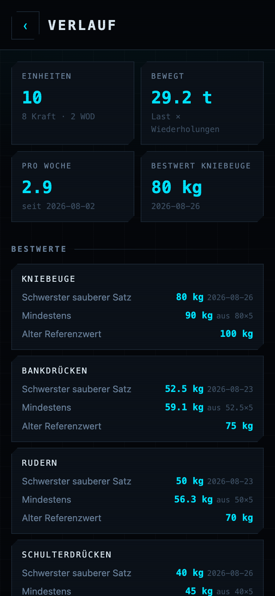
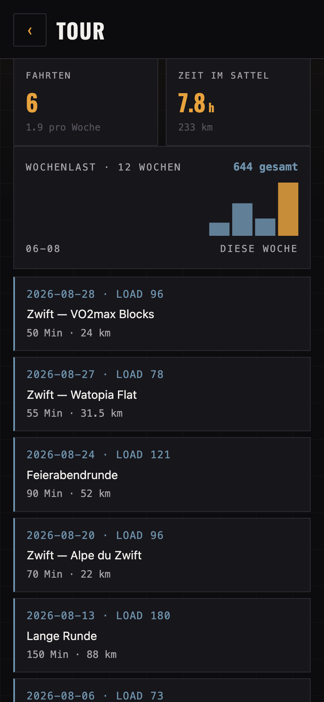
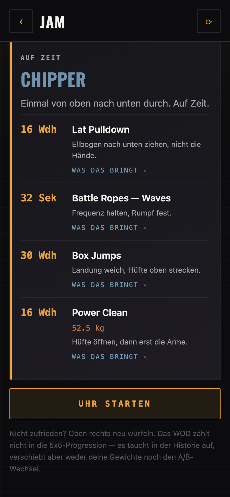
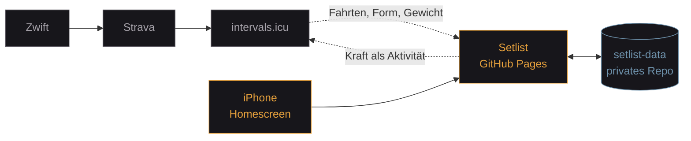
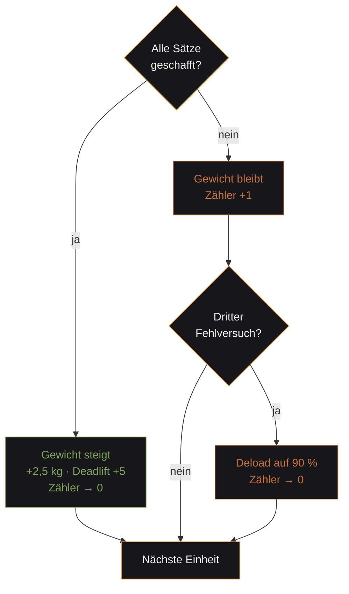

<p align="center">
  
</p>

<p align="center">
  <a href="https://cyphomat.github.io/setlist/"></a>
  
  
  
</p>

<p align="center">
  <b>Ein Trainingsplaner für eine Person.</b><br>
  Die Woche ist eine Setlist: 5×5 im Studio, Zwift im Keller, ein Jam zum Schluss.<br>
  Statische Web-App: kein Build, keine Bibliotheken, kein Server, keine Datenbank.
</p>

---

## So sieht es aus

<table>
<tr>
<td width="33%"></td>
<td width="33%"></td>
<td width="33%"></td>
</tr>
<tr>
<td align="center"><b>Die Ansage</b><br><sub>Ton aus Pause, Form und Rad</sub></td>
<td align="center"><b>Im Studio</b><br><sub>Scheiben, Kadenz, Sätze über dem Ziel</sub></td>
<td align="center"><b>Danach</b><br><sub>Erst der Erfolg, dann der Bericht</sub></td>
</tr>
<tr>
<td></td>
<td></td>
<td></td>
</tr>
<tr>
<td align="center"><b>Bestwerte</b><br><sub>Abgeleitet, nicht gepflegt</sub></td>
<td align="center"><b>Rad</b><br><sub>Wochenlast aus intervals.icu</sub></td>
<td align="center"><b>Jam</b><br><sub>Lasten aus dem aktuellen Stand</sub></td>
</tr>
</table>

<sub>Echte Bildschirme mit Beispieldaten, aufgenommen über <code>tools/shot.html</code>. Keine Mockups.</sub>

---

## Was sie dir sagt

Der Unterschied zu einem Logbuch: sie hat eine Meinung zum heutigen Tag — und die kommt aus Daten, nicht aus einem Zufallsgenerator.

**Die Ansage** liest Trainingspause, offene Fehlversuche, laufende Serie und den Abstand zu den alten Arbeitsgewichten und entscheidet daraus zwischen `TECHNIK`, `SOLIDE`, `HART` und `SCHWER`.

**Die Form** kommt aus intervals.icu — Fitness minus Ermüdung. Dazu die Interferenz-Warnung, wenn eine harte Fahrt weniger als vier Stunden her ist:

> **Rad vor 3 h** — Vor 3 Stunden hart gefahren. Unter vier Stunden Abstand leidet vor allem die Kraftausdauer — die letzten Sätze werden zäh. Das Maximalkraftniveau bleibt davon weitgehend unberührt: es ist Ermüdung, kein Rückschritt.

**Meilensteine** kennen die alten Bestleistungen samt Datum. Das sind Sätze, die kein Programm von der Stange sagen kann:

> **Aus deiner Geschichte** — Gestern vor 5 Jahren: 140 kg Back Squat. Heute stehst du bei 65 kg — nicht weil du weniger kannst, sondern weil du wieder anfängst.

**Minierfolge** stehen nach jeder Einheit ganz oben. Nicht der Bericht, sondern das Geschaffte — und auch ein durchwachsener Tag hat welche.

**Die Stimme** mischt eigene Zeilen aus `stimme.json` mit den 52 mitgelieferten. Etwa halbe halbe, per Münzwurf pro Tag — nicht nach Poolgröße, sonst gingen zwei eigene Zeilen zwischen fünfzig fremden unter.

---

## Wie es zusammenhängt



Setlist besitzt die **Kraft**-Progression. Zwei Systeme, die dasselbe Arbeitsgewicht berechnen, laufen unweigerlich auseinander — deshalb gibt es hier nur eines.

Das **Rad** wird nur als Hinweis geplant; die Ist-Daten entstehen ohnehin automatisch. Umgekehrt schreibt Setlist jede Krafteinheit zurück, damit die gesamte Last in **einer** Fitness-Kurve liegt statt in zwei getrennten Welten.

---

## Das Programm

|  | Übung 1 | Übung 2 | Übung 3 |
|---|---|---|---|
| **Workout A** | Back Squat 5×5 | Bench Press 5×5 | Barbell Row 5×5 |
| **Workout B** | Back Squat 5×5 | Strict Press 5×5 | Deadlift 1×5 |



Der Back Squat kommt in beiden Workouts vor und steigt daher doppelt so schnell.

5×5 ist auf drei Einheiten pro Woche ausgelegt. Bei ein bis zwei gilt dieselbe Mechanik, nur langsamer — **und Prozentregeln aus dem Original gelten dann nicht mehr.** Der Wiedereinstieg mit 60 % wäre bei dieser Frequenz zu sechs bis neun Wochen unter Reizschwelle geworden; daraus wurden 80 %.

---

## Funktionen

### Kraft

| | |
|---|---|
| **5×5-Automat** | Steigerung, Fehlerzähler, Deload. Reine Funktionen, kein I/O. |
| **Plattenrechner** | Scheiben pro Seite. Nicht exakt ladbare Gewichte werden benannt statt gerundet. |
| **Soundcheck** | Aus dem Arbeitsgewicht gerechnet: leere Stange, dann 55 / 70 / 85 % — mit Scheibenangabe. |
| **Gewicht im Satz** | Anpassbar während der Einheit. Das Log bildet ab, was passiert ist. |
| **Wiederholungen** | Tippen zählt das Ziel. Lange drücken öffnet 0 bis 12 — auch darüber. |
| **Umbaupause** | 90 s, nach einem Fehlversuch 180 s, im Lauf um ±30 s verstellbar. |
| **Bestwerte** | Schwerster sauberer Satz, gemessenes Einzel, **Maximum** (nur aus Max-Out) gegen **Mindestens** (aus Arbeitssätzen). |
| **Max-Out** | Krafttest mit e1RM. Dreht den A/B-Wechsel nicht. |
| **Wissen an der Stange** | Kadenz sichtbar; aufklappbar Begründung, Cue, typischer Fehler, Brücke zum olympischen Heben. |

### Rad und Kondition

| | |
|---|---|
| **Radfahrten** | Fahrten, Stunden, Kilometer, Wochenlast über zwölf Wochen. |
| **Trainingskalender** | 26 Wochen als Raster, eine Spalte je Woche. Kraft bernstein, Jam grün, Rad stahlblau, gemischte Tage diagonal geteilt. |
| **Wochenlast gestapelt** | Kraft und Rad in einem Balken — die eine Kurve, wegen der beides zusammengehört. |
| **Gewichtskurve** | Körpergewicht als Verlauf statt als Zahl. Bei Gewicht zählt nur die Richtung. |
| **Wochenvolumen** | Bewegtes Gewicht je Woche, beste Woche markiert. |
| **Fitness gegen Ermüdung** | Zwei Linien aus intervals.icu — die Fläche dazwischen *ist* die Form. |
| **Form** | Fitness minus Ermüdung, als Hinweis. Die App kürzt keine Gewichte eigenmächtig. |
| **Interferenz** | Warnt bei harter oder langer Fahrt unter vier Stunden Abstand. |
| **Wattziele** | Aus der eFTP statt Prozentangaben. |
| **Kraft → intervals.icu** | Jede Einheit als Aktivität, damit alles in einer Kurve liegt. |
| **Jam** | Fünf Formate, 19 Übungen, Lasten aus dem aktuellen Stand. Nie zwei Langhantelteile. |
| **Skalierung** | Jede Übung nennt Alternativen. „Kann ich nicht" nimmt sie dauerhaft raus. |

### App

| | |
|---|---|
| **Offline** | Einheiten werden gepuffert. Tour und Radansicht zeigen den letzten Stand. |
| **Selbstaktualisierend** | Prüft die Version beim Start und lädt sich genau einmal neu. |
| **Hell und dunkel** | Umschalter System / Hell / Dunkel. Zwei echte Fassungen, keine Invertierung. |
| **Handy und Mac** | Ab 900 px zwei Spalten, in der Tour breitere Raster. Auf dem Handy stapeln sie sich — dieselbe Reihenfolge, dasselbe Bild. |

---

## Beispiele

### Eine protokollierte Einheit

`einheiten/2026-08-26.json` — die **einzige echte Eingabe**:

```json
{
  "date": "2026-08-26",
  "workout": "A",
  "started": "2026-08-26T17:02:11.640Z",
  "finished": "2026-08-26T17:54:03.118Z",
  "lifts": [
    { "lift": "squat", "weight": 80,   "sets": 5, "target": 5, "reps": [5,5,5,5,5], "success": true },
    { "lift": "bench", "weight": 42.5, "sets": 5, "target": 5, "reps": [5,5,5,4,3], "success": false },
    { "lift": "row",   "weight": 50,   "sets": 5, "target": 5, "reps": [5,5,5,5,8], "success": true }
  ]
}
```

### Der daraus abgeleitete Zustand

```json
{
  "next": "B",
  "lifts": {
    "squat": { "weight": 82.5, "fails": 0 },
    "bench": { "weight": 42.5, "fails": 1 },
    "row":   { "weight": 52.5, "fails": 0 }
  }
}
```

Bench Press bleibt stehen und bekommt einen Fehlversuch. Barbell Row steigt, obwohl der letzte Satz acht statt fünf Wiederholungen hatte — mehr als das Ziel gilt als geschafft und hebt zusätzlich die Untergrenze des geschätzten Maximums.

### Plattenrechner

```
82,5 kg  →  pro Seite: 25 + 5 + 1,25
Aufwärmen:  2×5 @ 20 kg (leer) · 5 @ 45 kg · 3 @ 57,5 kg · 2 @ 70 kg
```

### Ein erzeugtes WOD

Gleicher Seed, gleiches Workout — ein Neuzeichnen tauscht es nicht unter dir weg:

```
CHIPPER · einmal von oben nach unten durch, auf Zeit
  16 Wdh   Lat Pulldown
  32 Sek   Battle Ropes — Waves
  30 Wdh   Walking Lunges
  16 Wdh   Power Clean @ 42,5 kg
```

### Was bei intervals.icu ankommt

```json
{
  "external_id": "setlist-2026-08-26-strength-A",
  "type": "WeightTraining",
  "name": "Kraft — Workout A",
  "start_date_local": "2026-08-26T19:02:11",
  "moving_time": 3112,
  "icu_training_load": 41,
  "description": "Back Squat 80 kg — 5/5/5/5/5\n…\n\nAus Setlist übertragen. Trainingslast geschätzt aus der Dauer (52 Min)."
}
```

Ohne bekannte Dauer wird **nichts** übertragen: eine erfundene Last wäre schlimmer als ein fehlender Eintrag.

---

## Entscheidungen, die tragen

### `state.json` ist abgeleitet, nicht gepflegt

> Eine Projektion aus `config.json` und allen Dateien in `einheiten/`.

„Neu berechnen" stellt sie jederzeit wieder her. Deshalb wird ein vertippter Eintrag nie zum Problem: Datei korrigieren, neu berechnen, fertig. Arbeitsgewichte werden nie direkt gesetzt — dafür gibt es den Log-Typ `anpassung`, damit auch das reproduzierbar bleibt.

### „Mindestens" ist nicht „Maximum"

e1RM-Formeln setzen Nähe zum Versagen voraus. Ein 5×5-Arbeitssatz ist submaximal, die Formel **unterschätzt** dort systematisch. Was aus Arbeitssätzen kommt, heißt deshalb Untergrenze. Aus demselben Grund mischt die Verlaufskurve die Quellen nicht: gestrichelte Linie für Untergrenzen, Max-Outs als eigene Punkte. Sonst sähe ein Wechsel der Datenquelle wie ein Rückschritt aus.

### Erst lesen, dann schreiben

`external_id` greift laut intervals.icu-Doku nur für dieselbe OAuth-Anwendung. Mit einem API-Key ist darauf kein Verlass. Kalendereinträge und nachgetragene Einheiten werden deshalb gegen den Bestand abgeglichen — über die Kennung und ersatzweise Datum plus Name. Doppelte Einträge im eigenen Konto sind ärgerlicher als fehlende.

### Die Rangordnung im Training

```
Rückgrat      5×5                   messbar progressiv, trägt alles andere
Auffrischung  Olympische Technik    leicht, im Warm-up-Slot, Qualität statt Last
Encore        Seile · Kondition     ans Ende, nie davor
```

Kein Geschmack, sondern der Grund, warum die Progression im Kaloriendefizit funktioniert.

### Backline statt Neon

Ein Röhrenamp glimmt, er strahlt nicht. Deshalb liegt Bernstein auf Zahlen, Kanten und dem, was gerade dran ist — die Flächen bleiben matt. Stahlblau trägt alles Zweitrangige: Rad, Jam, Nebenzahlen. Das ist keine Geschmacksfrage, sondern die Rangordnung: vorher war eine Radfahrt genauso laut wie ein Arbeitssatz, und die Seite hatte keine.

### Zwei Farbfassungen statt einer Invertierung

Farben, Flächen und Schleier laufen über CSS-Variablen, die die helle Fassung an **einer** Stelle umdefiniert. Aus fast Schwarz wird warmes Papier statt kaltem Weiß, und das Bernstein wird dunkler — sonst verschwindet es auf hellem Grund. Was bleibt: harte Rechtecke, Raster, kondensierte Versalien, Monospace-Zahlen.

### Die Schrift liegt im Repo

Oswald stammt von Google Fonts, wird aber nicht von dort geladen. Die Latin-Variante liegt als 21 KB große `woff2` unter `assets/fonts/` und wandert mit in den Service-Worker-Cache. Ein Font-Request nach außen hieße: eine Abhängigkeit mehr, ein anderes Aussehen offline, und ein Dritter, der mitbekommt, wann die App geöffnet wird. Die Lizenz (SIL OFL) liegt daneben.

### Die Stimme gehört dem Benutzer

Jeder Satz einer App wurde von jemand anderem geschrieben als dem, der sie benutzt. `stimme.json` löst das: eigene Zeilen mischen sich mit den mitgelieferten, ungefähr halbe halbe. Songtexte gehören nicht hinein — fremde Liedzeilen sind geschützt.

### Woher die Jams kommen

Aus `js/wod.js`. Die Formate sind die üblichen, Übungspool und Cues handgeschrieben, die Lasten aus dem aktuellen Stand abgeleitet. Keine externe Datenbank — und damit eine Datei, die man ändern kann. Der Pool ist auf eine konkrete Ausstattung zugeschnitten, die in `config.json` unter `orte` steht.

---

## Aufbau

| Datei | Rolle |
|---|---|
| `js/program.js` | 5×5-Automat, Plattenrechner, Aufwärmsätze, e1RM. Reine Funktionen, kein I/O. |
| `js/coach.js` | Ansage, Ton, Form, Interferenz, Meilensteine, Minierfolge. Ebenfalls rein. |
| `js/wod.js` | Jam-Generator, deterministisch über einen Seed. |
| `js/stats.js` | Tonnage, Bestwerte, Sparklines, Radstatistik. Rechnet, zeichnet nicht. |
| `js/content.js` | Wissensschicht: Warum je Übung, Cues, Soundcheck, Technik, Encore, 52 Zeilen. |
| `js/store.js` | GitHub-API als Speicher, Offline-Puffer, Wiederholversuche. |
| `js/intervals.js` | Liest Fahrten, Form und Gewicht; schreibt Krafteinheiten zurück. |
| `js/app.js` | Oberfläche und Ablauf. |
| `sw.js` | Cacht die App-Hülle. Trainingsdaten bewusst **nicht**. |
| `tools/shot.html` | Aufnahme-Vorrichtung für die Screenshots oben. |
| `tools/icon-gen.py` | Erzeugt die Icons. Reines Python, kein Bildprogramm. |
| `assets/fonts/` | Oswald als `woff2` plus Lizenz. Selbst gehostet, nicht von Google. |

---

## Tests

```sh
JSC=/System/Library/Frameworks/JavaScriptCore.framework/Versions/A/Helpers/jsc
for t in program coach wod stats intervals; do $JSC --module-file=tests/$t.test.js; done
```

**375 Tests**, ausgeführt von der JS-Engine, die in macOS ohnehin steckt. Kein Node, kein Framework, keine Installation.

Sie decken ab, was still kaputtgehen kann: Progression, Deload, Streak, Plattenaufteilung, e1RM, die Ableitbarkeit des Zustands — und dass ein WOD die Progression nicht anfasst.

---

## Veröffentlichen

```sh
sh tools/release.sh 2026-09-14.1
git add -A && git commit -m "…" && git push
```

Setzt `version.json` und den Cache-Namen in `sw.js` gemeinsam. Beides muss sich ändern, sonst merkt weder die App noch der Service Worker, dass es Neues gibt.

Screenshots neu aufnehmen:

```sh
python3 -m http.server 8765 &
sh tools/screens.sh
```

---

## Sechs Fallen, die Zeit gekostet haben

**Jekyll.** GitHub Pages schiebt statische Seiten durch einen Template-Prozessor, der über den JS-Code stolperte — der Build schlug fehl, ohne dass sich an der ausgelieferten Seite etwas änderte. `.nojekyll` schaltet ihn ab.

**`max-age=600`.** Pages liefert alles mit zehn Minuten Cache-Lebensdauer aus. Der Service Worker holte zwar „zuerst vom Netz", doch der HTTP-Cache des Browsers beantwortete die Anfrage selbst. Netz-zuerst war nur auf dem Papier vorhanden, bis `cache: 'no-cache'` dazukam.

**`/log`.** Ein Netzwerkabbruch traf reproduzierbar nur `contents/log`, während alles andere durchging — das Muster eines Inhaltsblockers. Der Ordner heißt jetzt `einheiten/`, der Verlauf läuft über `git/trees` und `git/blobs`.

**Ein Fehler im Fehlerbehandler.** Der Rückfall auf den letzten Stand rief die Diagramme auf, die ihrerseits die Konfiguration brauchten — die in dem Moment fehlte. Ergebnis war ein hängendes „Lade…". Die unangenehmste Sorte: sie zeigt sich genau dann, wenn ohnehin schon etwas schiefläuft.

**Eine Umbenennung, die vollständig aussah.** Beim Wechsel der Palette wurden alle Farbrollen umbenannt — und die Suche nach dem alten Namen fand nichts mehr. Drei Diagrammflächen trugen die alte Farbe trotzdem noch, weil sie als `rgba(0,229,255,.13)` dort standen, wo kein Token stand. Ein Rechteck sah türkis unter einer bernsteinfarbenen Linie aus. Gefunden im Browser, nicht im Code. Seitdem läuft jedes Farbliteral über ein Token.

**Ein linearer Hash.** Von zwei eigenen Zeilen erschien immer nur dieselbe. `h*31+c` ist in den untersten Bits linear — die Parität von `hash(x)` und `hash(salz+x)` hängt fest zusammen, egal wo man salzt. Münzwurf und Auswahl waren dadurch gekoppelt. Es brauchte eine Bit-Lawine, kein anderes Salz.

---

## Auf dem Mac

Es ist eine Web-App — die URL genügt. Für ein eigenes Fenster mit Icon:

- **Safari:** Ablage → *Zum Dock hinzufügen*
- **Chrome:** Adressleiste → *Installieren*

Auf dem großen Bildschirm wird die Tour zur Übersicht: Trainingskalender
über 26 Wochen, Kraft und Rad gestapelt, vier Kennzahlen nebeneinander,
Bestwerte zweispaltig und drei Verlaufskurven in einer Reihe.

Token und Key liegen im `localStorage` und damit **pro Gerät**. Auf dem Mac
werden sie einmal neu eingetragen; die Trainingsdaten kommen ohnehin aus dem
Repo und sind überall dieselben.

Was man nicht tun sollte: auf zwei Geräten **gleichzeitig** eine Einheit
abschließen. Nacheinander ist problemlos.

---

## Zugangsdaten

Nirgends im Code, nirgends im Repo, in keinem Commit. GitHub-Token und intervals.icu-Key werden in der App eingegeben und liegen ausschließlich im `localStorage` des jeweiligen Browsers.
