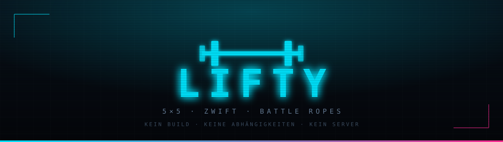
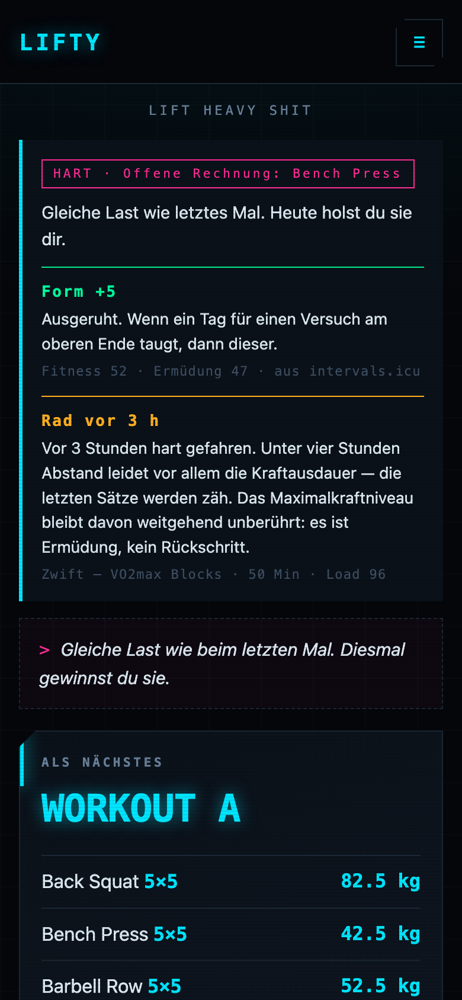
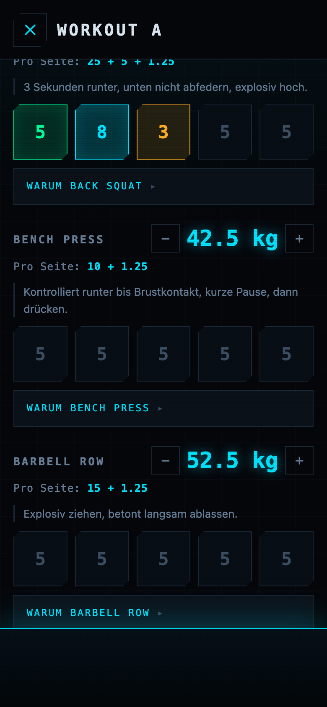
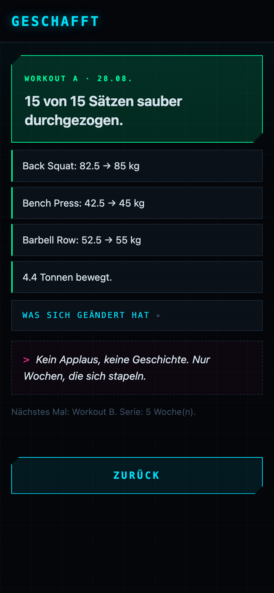
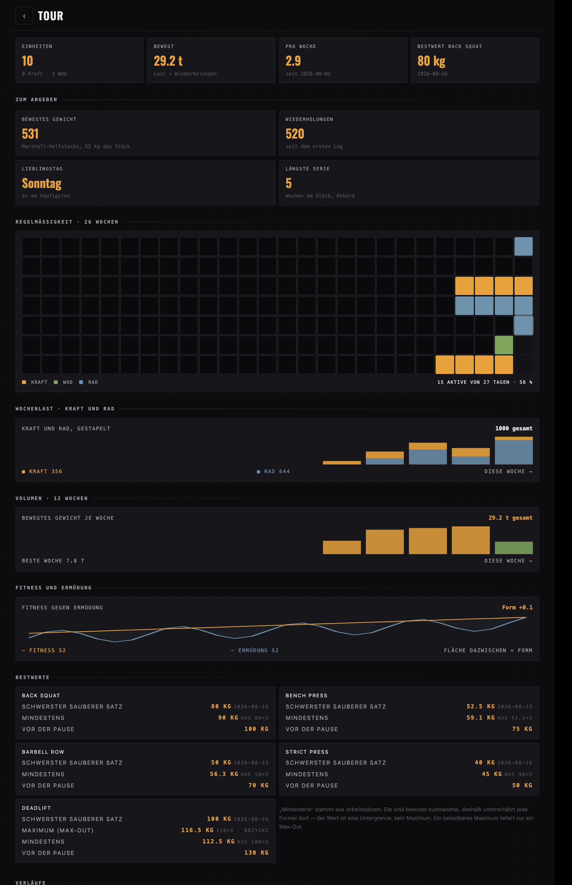

<p align="center">
  
</p>

<p align="center">
  <a href="https://cyphomat.github.io/setlist/"></a>
  
  
  
</p>

<p align="center">
  <b>Ein Trainingsplaner für eine Person.</b><br>
  Zweimal Kraft, zweimal Rad pro Woche. Die Woche ist eine Setlist.
</p>

---

## So sieht es aus

<table>
<tr>
<td width="33%"></td>
<td width="33%"></td>
<td width="33%"></td>
</tr>
<tr>
<td align="center"><b>Die Ansage</b><br><sub>Ton aus Pause, Form und Rad</sub></td>
<td align="center"><b>Im Studio</b><br><sub>Scheiben, Kadenz, Sätze über dem Ziel</sub></td>
<td align="center"><b>Danach</b><br><sub>Erst der Erfolg, dann der Bericht</sub></td>
</tr>
</table>

**Auf dem Mac wird daraus eine Übersicht** — Kalender, Wochenlast, Bestwerte und Verlaufskurven nebeneinander statt untereinander:



<sub>Echte Bildschirme mit Beispieldaten, aufgenommen über <code>tools/shot.html</code>. Keine Mockups.</sub>

---

## Was sie dir sagt

Der Unterschied zu einem Logbuch: sie hat eine Meinung zum heutigen Tag — aus Daten, nicht aus dem Bauch.

- **Die Ansage** liest Trainingspause, offene Fehlversuche, laufende Serie und Form vom Rad und entscheidet zwischen `TECHNIK`, `SOLIDE`, `HART` und `SCHWER` — und fragt nach der Einheit, wie sich das wirklich angefühlt hat. Die Ansage bleibt damit überprüfbar statt behauptet.
- **Interferenz-Warnung**, wenn eine harte Fahrt weniger als vier Stunden her ist — die letzten Sätze werden zäh, das Maximalkraftniveau bleibt unberührt.
- **Meilensteine** kennen die alten Bestleistungen samt Datum:

  > **Aus deiner Geschichte** — Gestern vor 5 Jahren: 140 kg Back Squat. Heute stehst du bei 65 kg — nicht weil du weniger kannst, sondern weil du wieder anfängst.

- **Minierfolge** stehen nach jeder Einheit ganz oben. Nicht der Bericht, sondern das Geschaffte.
- **Die Stimme** mischt eigene Zeilen aus `stimme.json` mit 52 mitgelieferten, etwa halbe halbe.

## Wie es zusammenhängt

```
Zwift ──▶ Strava ──▶ intervals.icu ◀──▶ Setlist ◀──▶ setlist-data (privat)
                            │                              │
                       Fahrten, Form                  Kraft-Progression
```

Setlist besitzt die **Kraft**-Progression — zwei Systeme, die dasselbe Arbeitsgewicht berechnen, laufen unweigerlich auseinander. Das **Rad** läuft andersherum: es kommt automatisch über Zwift → Strava → intervals.icu, Setlist zeigt es nur als Hinweis und schreibt im Gegenzug jede Krafteinheit zurück, damit Fitness und Ermüdung in einer Kurve liegen statt in zwei getrennten Welten.

Der Rückweg wartet bewusst bis zum nächsten App-Start: die Apple Watch erkennt Krafttraining oft selbst über die Herzfrequenz und reicht es mit Verzögerung über Strava nach. Ein sofortiger Push käme dem meist zuvor und dieselbe Einheit stünde doppelt in Fitness und Ermüdung.

## Zweimal und zweimal

5×5 ist ursprünglich für drei Einheiten pro Woche gebaut. Bei höchstens zwei gilt dieselbe Mechanik, nur langsamer — die 60-%-Regel für den Wiedereinstieg hätte bei dieser Frequenz sechs bis neun Wochen unter Reizschwelle bedeutet, deshalb sind es 80 %.

|  | Übung 1 | Übung 2 | Übung 3 |
|---|---|---|---|
| **Workout A** | Back Squat 5×5 | Bench Press 5×5 | Barbell Row 5×5 |
| **Workout B** | Back Squat 5×5 | Strict Press 5×5 | Deadlift 1×5 |

Back Squat ist in beiden Workouts dabei und steigt darum doppelt so schnell.

---

## Funktionen

### Kraft

| | |
|---|---|
| **5×5-Automat** | Steigerung, Fehlerzähler, Deload auf 90 % nach drei Fehlversuchen. |
| **Plattenrechner** | Scheiben pro Seite. Nicht exakt ladbare Gewichte werden benannt statt gerundet. |
| **Soundcheck** | Aufwärmsätze aus dem Arbeitsgewicht: leere Stange, dann 55 / 70 / 85 %. Jede Zeile abhakbar — angetippt durchgestrichen. |
| **Gewicht im Satz** | Anpassbar während der Einheit — das Log bildet ab, was wirklich passiert ist. |
| **Pausenuhr** | 90 s, nach Fehlversuch 180 s, im Lauf um ±30 s verstellbar. Endet mit Vibration und Ton, stoppt sich nach dem letzten Satz der Einheit selbst. |
| **Bestwerte** | `Maximum` (nur aus Max-Out) gegen `Mindestens` (aus Arbeitssätzen, systematisch zu niedrig). |
| **Max-Out** | Krafttest mit e1RM. Dreht den A/B-Wechsel nicht. |
| **Wissen an der Stange** | Aufklappbar: Begründung, Cue, typischer Fehler, Brücke zum olympischen Heben. |
| **Mobility** | Fünf Übungen, einmal pro Kalenderwoche fällig — bei der ersten Einheit (Kraft oder Jam), ganz gleich welcher. Eigener Button, jederzeit unabhängig davon nutzbar. |
| **Gefühl nach der Einheit** | Vier Stufen (Leicht/Normal/Hart/Extrem) auf dem Geschafft-Screen — macht die Ansage im Nachhinein überprüfbar. |
| **Ansage gegen Gefühl** | In der Tour: jede Einheit mit beiden Werten, dazu die Trefferquote — Ansage und gefühlte Schwere nebeneinander statt nur behauptet. |

### Rad und Kondition

| | |
|---|---|
| **Radfahrten** | Fahrten, Stunden, Kilometer, Wochenlast über zwölf Wochen — aus intervals.icu. |
| **Trainingskalender** | 26 Wochen als Raster: Kraft bernstein, Jam grün, Rad stahlblau. |
| **Wochenlast gestapelt** | Kraft und Rad in einem Balken — die eine Kurve, wegen der beides zusammengehört. |
| **Fitness gegen Ermüdung** | Zwei Linien aus intervals.icu — die Fläche dazwischen *ist* die Form. |
| **Wattziele** | Aus der eFTP statt Prozentangaben. |
| **Jam** | Fünf Formate, 27 Übungen, Lasten aus dem aktuellen Stand. Nie zwei Langhantelteile. |
| **Skalierung** | Jede Übung nennt Alternativen. „Kann ich nicht" nimmt sie dauerhaft raus. |

### App

| | |
|---|---|
| **Offline** | Einheiten werden gepuffert. Tour und Radansicht zeigen den letzten Stand. |
| **Selbstaktualisierend** | Prüft die Version beim Start und lädt sich genau einmal neu. |
| **Sound und Vibration** | Ton bei Pausenende und Einheitsabschluss, zusätzlich zur Vibration — Ton respektiert den Stumm-Schalter, Vibration nicht. |
| **Hell und dunkel** | Umschalter System / Hell / Dunkel. Zwei echte Fassungen, keine Invertierung. |
| **Handy und Mac** | Ab 900 px zwei Spalten, in der Tour breitere Raster — dieselbe Reihenfolge, kein Umbau. |

### Bibliothek

| | |
|---|---|
| **Alle Übungen an einem Ort** | Grundlifts, Technik, Mobility, Finisher und alle Jam-Bewegungen, durchsuchbar und nach Kategorie filterbar. |
| **Immer eine zufällige Übung** | Mit vollem Detail oben, bei jedem Aufruf neu gezogen — bleibt stabil, während man tippt oder filtert. |
| **YouTube-Suchlink statt geratenem Video** | Ein einzelnes fest verdrahtetes Video könnte offline oder falsch sein. Per eigenem Link überschreibbar. |
| **Eigene Notizen** | Landen in `bibliothek.json` in `setlist-data` und wachsen mit — dieselbe Wissensschicht wie `config.json`, nur für das, was du selbst gelernt hast. |

---

## Zwei Entscheidungen, die tragen

**`state.json` ist abgeleitet, nicht gepflegt.** Eine Projektion aus `config.json` und allen Dateien in `einheiten/`. Ein vertippter Eintrag wird nie zum Problem: Datei korrigieren, „state.json neu berechnen", fertig. Arbeitsgewichte werden nie direkt gesetzt — dafür gibt es den Log-Typ `anpassung`.

**„Mindestens" ist nicht „Maximum".** e1RM-Formeln setzen Nähe zum Versagen voraus; ein 5×5-Arbeitssatz ist submaximal, die Formel unterschätzt dort systematisch. Deshalb mischt die Verlaufskurve die Quellen nicht: gestrichelte Linie für Untergrenzen, Max-Outs als eigene Punkte.

---

## Aufbau

| Datei | Rolle |
|---|---|
| `js/program.js` | 5×5-Automat, Plattenrechner, e1RM. Reine Funktionen. |
| `js/coach.js` | Ansage, Ton, Meilensteine, Minierfolge. Ebenfalls rein. |
| `js/wod.js` | Jam-Generator, deterministisch über einen Seed. |
| `js/stats.js` | Tonnage, Bestwerte, Sparklines, Radstatistik. |
| `js/content.js` | Wissensschicht: Cues, Soundcheck, Technik, Encore, Stimme. |
| `js/bibliothek.js` | Bündelt alle Übungen zu einer durchsuchbaren Liste. |
| `js/store.js` | GitHub-API als Speicher, Offline-Puffer. |
| `js/intervals.js` | Liest Fahrten und Form; schreibt Krafteinheiten zurück. |
| `js/app.js` | Oberfläche und Ablauf. |
| `sw.js` | Cacht die App-Hülle. Trainingsdaten bewusst **nicht**. |

---

## Tests

```sh
JSC=/System/Library/Frameworks/JavaScriptCore.framework/Versions/A/Helpers/jsc
for t in program coach wod stats intervals bibliothek; do $JSC --module-file=tests/$t.test.js; done
```

428 Tests, ausgeführt von der JS-Engine, die in macOS ohnehin steckt. Kein Node, kein Build.

---

## Veröffentlichen

```sh
sh tools/release.sh 2026-09-14.1
git add -A && git commit -m "…" && git push
```

Setzt `version.json` und den Cache-Namen in `sw.js` gemeinsam — beides muss sich ändern, sonst merkt die App nichts Neues.

Screenshots neu aufnehmen:

```sh
python3 -m http.server 8765 &
sh tools/screens.sh
```

---

## Auf dem Mac

Web-App, die URL genügt. Für ein eigenes Fenster: **Safari** → Ablage → *Zum Dock hinzufügen*, oder **Chrome** → Adressleiste → *Installieren*.

Token und Key liegen im `localStorage`, also pro Gerät — auf dem Mac einmal neu eintragen. Die Trainingsdaten kommen aus dem Repo und sind überall dieselben. Zwei Geräte gleichzeitig eine Einheit abschließen lassen sollte man nicht; nacheinander ist problemlos.

## Zugangsdaten

Nirgends im Code, nirgends im Repo, in keinem Commit. GitHub-Token und intervals.icu-Key werden in der App eingegeben und liegen ausschließlich im `localStorage` des jeweiligen Browsers.
