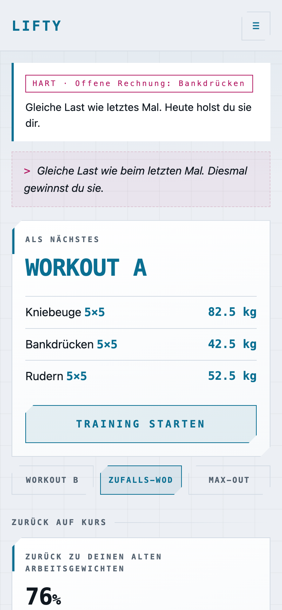
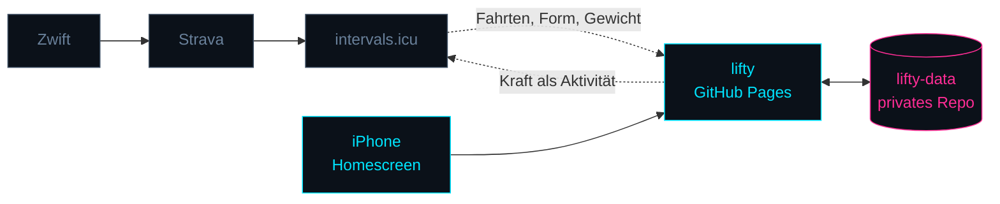
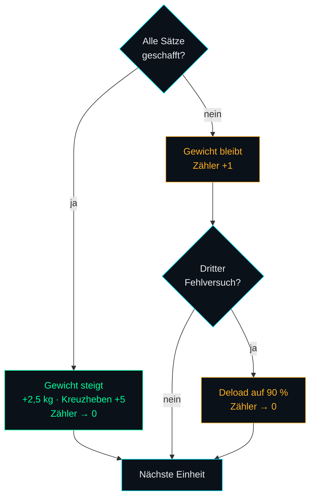

<p align="center">
  
</p>

<p align="center">
  <a href="https://cyphomat.github.io/lifty/"></a>
  
  
  
</p>

<p align="center">
  <b>Trainings-HUD für StrongLifts 5×5, Zwift und Battle Ropes.</b><br>
  Statische Web-App. Kein Build, keine Bibliotheken, kein Server, keine Datenbank.
</p>

---

## So sieht es aus

<table>
<tr>
<td width="33%"></td>
<td width="33%"></td>
<td width="33%"></td>
</tr>
<tr>
<td align="center"><b>Ansage des Tages</b><br><sub>Ton aus Pause, Fehlversuchen und Form</sub></td>
<td align="center"><b>Im Studio</b><br><sub>Scheiben, Kadenz, Sätze über dem Ziel</sub></td>
<td align="center"><b>Bestwerte</b><br><sub>Abgeleitet, nicht gepflegt</sub></td>
</tr>
<tr>
<td></td>
<td></td>
<td></td>
</tr>
<tr>
<td align="center"><b>Rad</b><br><sub>Wochenlast aus intervals.icu</sub></td>
<td align="center"><b>Zufalls-WOD</b><br><sub>Lasten aus dem aktuellen Stand</sub></td>
<td align="center"><b>Helle Fassung</b><br><sub>Kein Neon, gleiche Formen</sub></td>
</tr>
</table>

<sub>Aufnahmen mit Beispieldaten, entstanden über `tools/shot.html` — echte Bildschirme, keine Mockups.</sub>

---

## Funktionen

### Kraft

| | |
|---|---|
| **5×5-Automat** | Alle Sätze geschafft → +2,5 kg (Kreuzheben +5). Ein Satz zu kurz → Gewicht bleibt, Zähler steigt. Drei Fehlversuche → Deload auf 90 %. |
| **Ansage des Tages** | `TECHNIK`, `SOLIDE`, `HART` oder `SCHWER` — abgeleitet aus Pause, offenen Fehlversuchen, laufender Serie und Abstand zu den alten Arbeitsgewichten. Kein Zufallsgenerator. |
| **Plattenrechner** | Scheiben pro Seite unter jeder Übung. Nicht exakt ladbare Gewichte werden benannt statt stillschweigend gerundet. |
| **Aufwärmsätze** | Aus dem Arbeitsgewicht gerechnet: leere Stange, dann 55 / 70 / 85 % mit absteigenden Wiederholungen — jeweils mit Scheibenangabe. |
| **Gewicht im Satz** | Lässt sich während der Einheit anpassen. Das Log bildet ab, was passiert ist; die Progression rechnet von dort weiter. |
| **Wiederholungen** | Tippen zählt das Ziel. Lange drücken öffnet 0 bis 12 — auch darüber, denn ein starker Satz ist eine Information. |
| **Pausenuhr** | 90 s, nach einem Fehlversuch 180 s, im Lauf um ±30 s verstellbar. |
| **Bestwerte** | Schwerster sauberer Satz, gemessenes Einzel, geschätztes Maximum. |
| **Max-Out** | Krafttest mit e1RM. Dreht den A/B-Wechsel nicht und ändert Arbeitsgewichte nur auf ausdrückliche Ansage. |
| **Wissen an der Stange** | Kadenz direkt sichtbar; aufklappbar Begründung, Cue, typischer Fehler und die Brücke zum olympischen Heben. |

### Rad und Kondition

| | |
|---|---|
| **Radfahrten** | Fahrten, Stunden, Kilometer und die Wochenlast der letzten zwölf Wochen als Balken. |
| **Form** | Fitness minus Ermüdung aus intervals.icu, als Hinweis in der Tagesansage. Die App kürzt keine Gewichte eigenmächtig. |
| **Kraft → intervals.icu** | Jede Krafteinheit und jedes WOD als Aktivität, damit die gesamte Last in **einer** Kurve liegt. |
| **Zufalls-WOD** | AMRAP, Auf Zeit, EMOM, Chipper, Tabata. Lasten aus dem aktuellen Stand abgeleitet, nie zwei Langhantelteile. |
| **Technik und Finisher** | Snatch Balance, Hang Power Clean, Overhead Squat · Battle Ropes, Farmer Walk. Täglich rotierend. |

### App

| | |
|---|---|
| **Offline** | Einheiten werden gepuffert und nachgetragen. Verlauf und Radansicht zeigen den letzten Stand statt einer Fehlermeldung. |
| **Selbstaktualisierend** | Prüft beim Start die ausgelieferte Version und lädt sich genau einmal neu. |
| **Hell und dunkel** | Umschalter System / Hell / Dunkel. |

---

## Wie es zusammenhängt



lifty besitzt die **Kraft**-Progression. Die StrongLifts-App wurde abgelöst — zwei
Systeme, die dasselbe Arbeitsgewicht berechnen, laufen unweigerlich auseinander.

Das **Rad** plant lifty nur als Hinweis; die Ist-Daten entstehen ohnehin automatisch.
Umgekehrt schreibt lifty jede Krafteinheit als Aktivität zurück, damit die gesamte
Trainingslast in einer Fitness-Kurve liegt statt in zwei getrennten Welten.

---

## Das Programm

|  | Übung 1 | Übung 2 | Übung 3 |
|---|---|---|---|
| **Workout A** | Kniebeuge 5×5 | Bankdrücken 5×5 | Rudern 5×5 |
| **Workout B** | Kniebeuge 5×5 | Schulterdrücken 5×5 | Kreuzheben 1×5 |



Die Kniebeuge kommt in beiden Workouts vor und steigt daher doppelt so schnell.
5×5 ist auf drei Einheiten pro Woche ausgelegt; bei ein bis zwei gilt dieselbe
Mechanik, nur langsamer.

---

## Beispiele

### Eine protokollierte Einheit

`einheiten/2026-08-26.json` — die **einzige echte Eingabe**:

```json
{
  "date": "2026-08-26",
  "workout": "A",
  "started": "2026-08-26T17:02:11.640Z",
  "finished": "2026-08-26T17:54:03.118Z",
  "lifts": [
    { "lift": "squat", "weight": 80,   "sets": 5, "target": 5, "reps": [5,5,5,5,5], "success": true },
    { "lift": "bench", "weight": 42.5, "sets": 5, "target": 5, "reps": [5,5,5,4,3], "success": false },
    { "lift": "row",   "weight": 50,   "sets": 5, "target": 5, "reps": [5,5,5,5,8], "success": true }
  ]
}
```

### Der daraus abgeleitete Zustand

`state.json` — wird **nie** von Hand gepflegt:

```json
{
  "next": "B",
  "lifts": {
    "squat": { "weight": 82.5, "fails": 0 },
    "bench": { "weight": 42.5, "fails": 1 },
    "row":   { "weight": 52.5, "fails": 0 }
  }
}
```

Bankdrücken bleibt stehen und bekommt einen Fehlversuch angerechnet. Rudern steigt,
obwohl der letzte Satz acht statt fünf Wiederholungen hatte — mehr als das Ziel gilt
als geschafft und hebt zusätzlich das geschätzte Maximum.

### Plattenrechner

```
82,5 kg  →  pro Seite: 25 + 5 + 1,25
Aufwärmen:  2×5 @ 20 kg (leer) · 5 @ 45 kg · 3 @ 57,5 kg · 2 @ 70 kg
```

### Ein erzeugtes WOD

Gleicher Seed liefert dasselbe Workout — ein Neuzeichnen tauscht es nicht unter dir weg:

```
CHIPPER · einmal von oben nach unten durch, auf Zeit
   8 Wdh   Klimmzüge
  32 Sek   Battle Ropes — Wellen
  30 Wdh   Box Jumps
  16 Wdh   Power Clean @ 42,5 kg
```

### Was bei intervals.icu ankommt

```json
{
  "external_id": "lifty-2026-08-26-strength-A",
  "type": "WeightTraining",
  "name": "Kraft — Workout A",
  "start_date_local": "2026-08-26T19:02:11",
  "moving_time": 3112,
  "icu_training_load": 41,
  "description": "Kniebeuge 80 kg — 5/5/5/5/5\n…\n\nAus lifty übertragen. Trainingslast geschätzt aus der Dauer (52 Min)."
}
```

Ist keine Dauer bekannt, wird **nichts** übertragen: eine erfundene Last wäre
schlimmer als ein fehlender Eintrag.

---

## Die tragende Invariante

> `state.json` ist **abgeleitet**, nicht gepflegt — eine Projektion aus
> `config.json` und allen Dateien in `einheiten/`.

„Neu berechnen" stellt sie jederzeit wieder her. Deshalb wird ein vertippter
Eintrag nie zum Problem: Datei korrigieren, neu berechnen, fertig.

Wer hier abkürzt und `state.json` direkt fortschreibt, verliert genau diese
Eigenschaft. Dafür gibt es Tests.

---

## Die Rangordnung im Training

```
Rückgrat      5×5                   messbar progressiv, trägt alles andere
Auffrischung  Olympische Technik    leicht, im Warm-up-Slot, Qualität statt Last
Zugabe        Seile · Kondition     als Finisher ans Ende, nie davor
```

Kein Geschmack, sondern der Grund, warum die Progression im Kaloriendefizit
funktioniert. Wer den Finisher nach vorn zieht oder die Technikarbeit schwer
macht, kippt sie.

---

## Aufbau

| Datei | Rolle |
|---|---|
| `js/program.js` | 5×5-Automat, Plattenrechner, Aufwärmsätze, e1RM. Reine Funktionen, kein I/O. |
| `js/coach.js` | Ansage, Ton, Fortschritt, Form. Ebenfalls rein. |
| `js/wod.js` | Zufalls-WOD, deterministisch über einen Seed. |
| `js/stats.js` | Tonnage, Bestwerte, Sparklines, Radstatistik. Rechnet, zeichnet nicht. |
| `js/content.js` | Wissensschicht: Warum je Übung, Cues, Warm-up, Technik, Finisher. |
| `js/store.js` | GitHub-API als Speicher, Offline-Puffer, Wiederholversuche. |
| `js/intervals.js` | Liest Fahrten, Form und Gewicht; schreibt Krafteinheiten zurück. |
| `js/app.js` | Oberfläche und Ablauf. |
| `sw.js` | Cacht die App-Hülle. Trainingsdaten bewusst **nicht**. |
| `tools/shot.html` | Aufnahme-Vorrichtung für die Screenshots oben. |

---

## Tests

```sh
JSC=/System/Library/Frameworks/JavaScriptCore.framework/Versions/A/Helpers/jsc
for t in program coach wod stats intervals; do $JSC --module-file=tests/$t.test.js; done
```

**211 Tests**, ausgeführt von der JS-Engine, die in macOS ohnehin steckt.
Kein Node, kein Framework, keine Installation.

Sie decken ab, was still kaputtgehen kann: Progression, Deload, Streak,
Fortschritt zur Referenz, Plattenaufteilung, e1RM, die Ableitbarkeit des
Zustands — und dass ein WOD die Progression nicht anfasst.

---

## Veröffentlichen

```sh
sh tools/release.sh 2026-09-14.1
git add -A && git commit -m "…" && git push
```

Setzt `version.json` und den Cache-Namen in `sw.js` gemeinsam. Beides muss sich
ändern, sonst merkt weder die App noch der Service Worker, dass es Neues gibt.

Screenshots neu aufnehmen:

```sh
python3 -m http.server 8765 &
sh tools/screens.sh
```

---

## Vier Fallen, die Zeit gekostet haben

**Jekyll.** GitHub Pages schiebt statische Seiten durch einen Template-Prozessor,
der über den JS-Code stolperte — der Build schlug fehl, ohne dass sich an der
ausgelieferten Seite etwas änderte. `.nojekyll` schaltet ihn ab.

**`max-age=600`.** Pages liefert alles mit zehn Minuten Cache-Lebensdauer aus.
Der Service Worker holte zwar „zuerst vom Netz", doch der HTTP-Cache des Browsers
beantwortete die Anfrage selbst. Netz-zuerst war nur auf dem Papier vorhanden,
bis `cache: 'no-cache'` dazukam.

**`/log`.** Ein Netzwerkabbruch traf reproduzierbar nur `contents/log`, während
alles andere durchging — das Muster eines Inhaltsblockers, der Adressen mit
diesem Wegstück verwirft. Der Ordner heißt jetzt `einheiten/`, und der Verlauf
wird über `git/trees` und `git/blobs` gelesen.

**Ein Fehler im Fehlerbehandler.** Der Rückfall auf den letzten Stand rief die
Diagramme auf, die ihrerseits die Konfiguration brauchten — die in dem Moment
fehlte. Ergebnis war ein hängendes „Lade…". Die unangenehmste Sorte Fehler:
sie zeigt sich genau dann, wenn ohnehin schon etwas schiefläuft.

---

## Warum es zwei echte Farbfassungen gibt

Leuchteffekte, vertiefte Flächen und Farbschleier laufen über CSS-Variablen,
die die helle Fassung an **einer** Stelle umdefiniert. Glüheffekte werden
abgeschaltet, nicht abgeschwächt — auf Weiß werden sie zu Schmutz statt zu
Atmosphäre. Die Akzente werden dunkler, weil Neon-Cyan auf Hell unlesbar ist.

Was bleibt: Kantenschnitt, Raster, Monospace-Zahlen, Großbuchstaben-Marken.
Die tragen die Identität, nicht das Glühen.

---

## Zugangsdaten

Nirgends im Code, nirgends im Repo, in keinem Commit. GitHub-Token und
intervals.icu-Key werden in der App eingegeben und liegen ausschließlich im
`localStorage` des jeweiligen Browsers.
